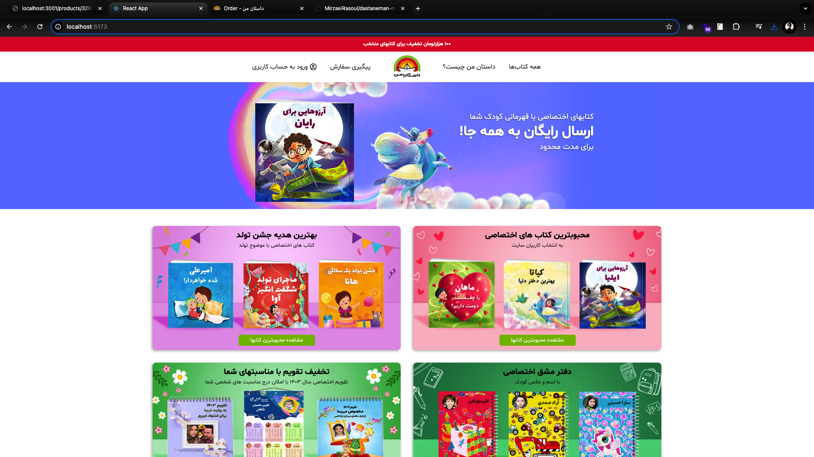

# Dastane Man Website - React + Node.js + Express

This template provides a minimal setup to get React working in Vite with HMR and some ESLint rules.

Dastane Man is a website in the field of developing educational technologies for children. The special product of this website is exclusive and customized books for children centered on heroic characters. Easily modifiable, hosted by GitHub, and built using MERN (MongoDB, Express, React, and Node.js).

